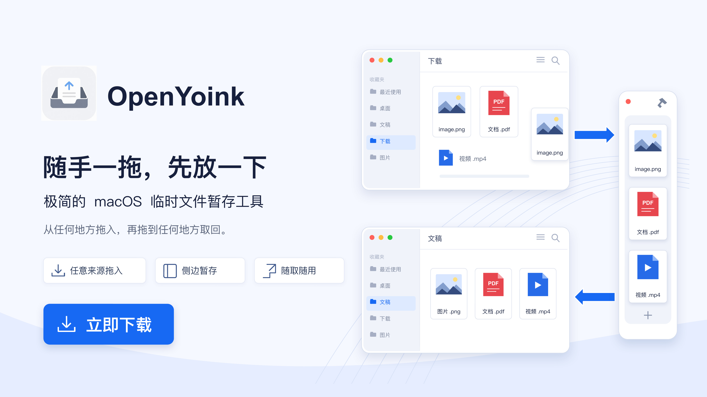

<div align="center">


# OpenYoink

**随手一拖，先放一下。**

macOS 文件暂存工具。把文件、文本、图片或链接拖到屏幕侧边或顶部灵动岛，
切换窗口后，再拖到需要的地方。

<br>

[](https://github.com/MuQY1818/OpenYoink/releases/latest)
[](https://github.com/MuQY1818/OpenYoink/releases)
[](https://developer.apple.com/macos/)
[](https://github.com/MuQY1818/OpenYoink/stargazers)
[](LICENSE)

[下载](https://github.com/MuQY1818/OpenYoink/releases/latest) ·
[官网](https://muqy1818.github.io/OpenYoink/) ·
[使用文档](https://muqy1818.github.io/OpenYoink/guide/) ·
[English](README.en.md)

</div>

<br>

<a href="https://muqy1818.github.io/OpenYoink/">
  
</a>

把下载文件夹里的文件发到聊天窗口时，可以先拖进 OpenYoink，松开鼠标，再切到聊天窗口拖出去。

OpenYoink 常驻菜单栏，没有 Dock 图标。侧边暂存架和顶部灵动岛可以单独使用，也能一起开，两边的内容是共享的。

## 功能

- 暂存文件、文件夹、文本、图片和链接。来源应用支持时，也能接收邮件、日历事件和联系人。
- 按空格预览内容，支持多选、框选、堆叠（Stack）、手动排序和最近项目。
- 通过边缘拉环、快捷键、鼠标摇动或拖拽唤出；可以按应用关闭自动唤出。
- 可选剪贴板历史，支持搜索、预览、复制和加入暂存架，默认不记录。
- 支持多显示器、多个 Space 和全屏应用，提供中英文界面、登录时启动和自动更新。

灵动岛还可以查看传输进度、电池功率、系统状态和正在播放的歌曲，或打开收藏的文件夹。各模块可以单独关闭，详见[灵动岛模块](#灵动岛模块)。

## 安装

需要 macOS 15 Sequoia 或更高版本，支持 Apple Silicon 和 Intel Mac。

### Homebrew（推荐）

```bash
brew install --cask muqy1818/tap/openyoink
```

Homebrew 从 GitHub Releases 下载安装包，并在安装后移除 OpenYoink 的隔离属性。这会跳过该应用的 Gatekeeper 隔离检查，但不等于 Apple 公证。

### 手动安装

1. 从 [GitHub Releases](https://github.com/MuQY1818/OpenYoink/releases/latest) 下载最新 DMG。
2. 打开 DMG，将 OpenYoink 拖入 `Applications`。
3. 首次启动若被 macOS 拦截，在 Finder 中右键 OpenYoink 并选择“打开”，或前往 **系统设置 → 隐私与安全性** 允许打开。

> [!NOTE]
> GitHub Releases 提供 ad-hoc 签名的社区构建，尚未经过 Apple 公证，手动安装可能被 macOS 拦截。自动更新使用 Sparkle EdDSA 校验，不能替代首次下载校验或 Apple 公证。

<details>
<summary>仍然无法打开？</summary>

先确认安装包来自上面的 GitHub Releases。运行 `shasum -a 256 OpenYoink-VERSION.dmg`（把 `VERSION` 换成实际版本号），与对应版本的 Release 校验值或 [Homebrew cask](https://github.com/MuQY1818/homebrew-tap/blob/main/Casks/openyoink.rb) 中的 `sha256` 比对。

确认来源和校验值后，可以用下面的命令移除 OpenYoink 的隔离属性。这会绕过该应用的 Gatekeeper 隔离检查：

```bash
xattr -dr com.apple.quarantine /Applications/OpenYoink.app
```

</details>

## 快速上手

| 操作           | 方式                                                   |
| -------------- | ------------------------------------------------------ |
| 显示 / 隐藏    | `⌘⇧Space`、菜单栏菜单，或单击屏幕边缘的拉环           |
| 添加内容       | 拖到暂存架或边缘拉环上                                 |
| 托管移动       | 按住 `⌘` 拖入；确认副本后将原文件移入废纸篓，[详细说明](#文件安全与生命周期) |
| 暂存剪贴板     | 连按两次 `⌘⇧Space`                                     |
| Quick Look     | 选中卡片后按 `Space`，或双击卡片                       |
| 多选           | 按住 `⌘` 点选，或在空白处拖动框选                      |
| 移除           | 悬停后点 `×`、按 `Delete`，或右键菜单                  |
| 调整位置       | 沿屏幕边缘拖动拉环，或在设置中选择位置                 |
| 开启 / 关闭 Island | 设置 → 通用 → OpenYoink Island                    |

顶部拖拽展开默认关闭，可在设置中开启。侧边暂存架的拖拽唤出独立设置。更多操作见[使用文档](https://muqy1818.github.io/OpenYoink/guide/)。

## 灵动岛模块

新安装默认开启 OpenYoink Island。有刘海的 Mac 使用刘海两侧，无刘海屏幕显示顶部胶囊。

| 模块 | 用途 |
| --- | --- |
| 暂存架 | 与侧边暂存架共享内容，支持拖入、拖出、预览和整理 |
| 传输 | 查看异步文件交付的进度和失败状态 |
| 计时器 | 预设或自定义倒计时，支持暂停和继续 |
| 电池 | 查看电量、充放电功率和最近两分钟的功率波形 |
| 系统状态 | 查看 CPU、内存、网络、磁盘和应用占用 |
| 正在播放 | 查看歌曲信息、封面和进度，控制播放 |
| 快速访问 | 收藏文件夹，双击交给系统默认文件管理器打开，支持 Finder、QSpace 等 |
| 剪贴板历史 | 搜索、预览和复用最近复制的内容 |

正在播放、快速访问和剪贴板历史模块默认关闭，可以按需开启。开启剪贴板模块不会自动开启记录。

## 文件安全与生命周期

普通拖入只保存原文件的引用，不移动原文件。移除卡片或开启“拖出后移除”也不会删除原文件。拖到 Finder 时只请求复制，最终是否接收由目标应用决定。

> [!WARNING]
> 按住 `⌘` 拖入会启用托管移动：先复制到应用沙箱，确认副本后，再把原文件移入废纸篓。失败时保留原文件并回退为普通引用。原文件只能在废纸篓尚未清空时恢复。

托管移动项目交付成功后，卡片和沙箱内副本才会删除，不受普通项目的“拖出后处理”设置影响。取消或交付失败会保留卡片和副本，供下次重试。

<details>
<summary>不同内容如何保存、何时清理</summary>

| 内容                       | OpenYoink 的处理方式                                   |
| -------------------------- | ------------------------------------------------------ |
| 文件与文件夹               | 保存原文件位置的访问授权（sandbox bookmark），默认不复制 |
| 纯文本与链接               | 直接记录在暂存架数据中                                 |
| 图片、HTML 与 RTF          | 保存为应用沙箱内的文件                                 |
| 联系人、日历事件与邮件     | 来源应用提供可读数据时，保存为 `.vcf`、`.ics`、`.eml`  |

若原文件被移动、删除或所在磁盘离线，卡片会显示不可用，直到文件引用重新解析成功。

文本和链接随卡片保存，移除时一并清除。图片、富文本、邮件等生成的文件在卡片移除后，通常在下次启动时清理；也可以在“设置 → 存储”查看和清理未使用文件。

普通文件拖出提供文件 URL 和 Chromium 兼容的文件名表示；托管移动使用 file promise，收到目标写入确认后才离架。兼容性仍取决于目标应用或网站。

</details>

## 隐私与权限

- 不需要账号，不收集分析数据或遥测。内容保存在本机沙箱内的 `Application Support/OpenYoink`。
- 应用启用 App Sandbox，只访问你主动拖入或选择的文件。正常使用不要求辅助功能或输入监控权限。
- 自动更新检查默认开启，可以关闭。应用的后台联网用于访问 GitHub Pages / Releases 检查和下载更新。
- 正在播放模块不联网，优先使用本地 helper，备用 Apple Music / Spotify AppleScript 可能请求“自动化”权限。模块失效不影响暂存架。
- 快速访问只保存你添加的文件夹引用。移除收藏不会删除真实文件夹，默认打开方式交给 macOS 决定。

### 剪贴板历史

记录默认关闭。没有开启时，只有连按两次快捷键暂存剪贴板才读取当前内容。开启或恢复后，只记录新复制的文本、HTTP(S) 网址和 PNG/TIFF 图片，不追溯旧内容，也不记录复制的文件。

历史在本机以明文保存，不上传、不同步。最多保存 30 条、总计 20 MiB，可保留 1、7 或 30 天，默认 7 天。关闭记录会保留已有历史，清空才会删除它们。

会跳过常见密码管理器的隐私标记和忽略应用，但无法识别所有敏感内容。复制密码或令牌前，请先暂停记录。

## 从源码构建

开发环境需要 macOS 15+ 与 Xcode 26+。

```bash
git clone https://github.com/MuQY1818/OpenYoink.git
cd OpenYoink

xcodebuild \
  -project Open-Yoink.xcodeproj \
  -scheme OpenYoink \
  -destination 'platform=macOS' \
  build

xcodebuild \
  -project Open-Yoink.xcodeproj \
  -scheme OpenYoink \
  -destination 'platform=macOS' \
  test \
  -only-testing:OpenYoinkTests
```

使用 Swift 6、SwiftUI 和 AppKit。本地构建无需设置 `DEVELOPMENT_TEAM`，上面的测试命令只运行应用单元测试，不运行 UI 自动化。

发布脚本见 [`Scripts/make-release.sh`](Scripts/make-release.sh)：支持 Developer ID 签名与公证，或显式传入 `--adhoc` 生成社区构建。签名失败不会自动降级。

## 参与项目

遇到问题或有功能建议，可以提 [Issue](https://github.com/MuQY1818/OpenYoink/issues)。报告问题时请附上 macOS 版本、OpenYoink 版本和复现步骤；截图中不要包含私人文件或剪贴板内容。

也欢迎 Pull Request。较大的改动先开 Issue 讨论，代码提交前请运行完整单元测试。

## Star History

项目 Star 数量随时间的变化：

<a href="https://www.star-history.com/?repos=MuQY1818%2FOpenYoink&amp;type=date">
  <picture>
    <source media="(prefers-color-scheme: dark)" srcset="https://api.star-history.com/svg?repos=MuQY1818/OpenYoink&amp;type=Date&amp;theme=dark">
    <source media="(prefers-color-scheme: light)" srcset="https://api.star-history.com/svg?repos=MuQY1818/OpenYoink&amp;type=Date">
    
  </picture>
</a>

## 致谢与许可

OpenYoink 采用 [MIT License](LICENSE)。这是独立的开源项目，与商业应用 Yoink 及其开发者无隶属关系。

自动更新使用 [Sparkle](https://sparkle-project.org/)，Star 趋势图由 [Star History](https://www.star-history.com/) 提供。第三方组件与许可证见 [`THIRD_PARTY_NOTICES.md`](THIRD_PARTY_NOTICES.md)。

<br>

<div align="center">

© 2026 weijue · MIT License

</div>
